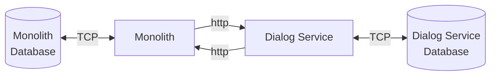
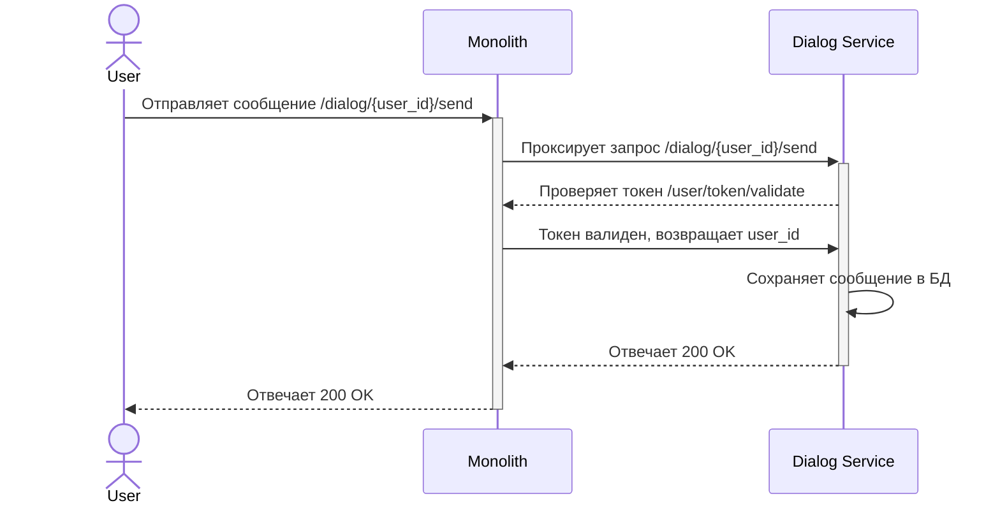

# Занятие 2 - Разделение монолита на сервисы

Дана [OpenApi спецификация](./openapi.json).

1. Написать монолит, минимально реализующий данную спецификацию
2. Вынести в сервис dialog-service часть связанную с диалоговой системой

Требования:
- после выноса части логики в отдельный сервис монолит продолжает работать
- обеспечить обратную совместимость при запросах к монолиту в части диалоговой системы

Репозиторий разделен на две директории, реализующие соответствующие этапы из задания `01_monolith` и `02_monolith_and_service`.

## Запуск демонстрации

Для запуска определенного этапа необходимо:

1. перейти в нужную директорию

    ```sh
    cd 01_monolith # или cd 02_monolith_and_service
    ```

2. Выполнить сборку образов командой
   ```sh
   make build
   ```

3. Запустить демонстрацию командой
    ```sh
    make start
    ```

4. Для остановки выполнить команду
   ```sh
   make stop
   ```

При старте, монолит прослушивает внешний порт `3000`, сервис диалогов прослушивает внешний порт `3001`.

## Схема взаимодействия сервисов

#### Архитектурная схема взаимодействия сервисов:


#### Пример обработки события отправки сообщения пользователем:

