# Часть A

Шаги выполнения:

1. Запуск окружения

    - выполнен переход в директорию `dz-3/partA`
    - выполнена команда `make up`
    - в результате подняты контейнеры с нужным окружением

    ```sh
    developer@ubuntu-dev:~$ docker ps -a
    CONTAINER ID   IMAGE                        COMMAND                  CREATED         STATUS         PORTS                                                                                          NAMES
    4eaaaa98f06f   prom/prometheus:v2.54.1      "/bin/prometheus --c…"   4 minutes ago   Up 4 minutes   0.0.0.0:9090->9090/tcp, [::]:9090->9090/tcp                                                    prometheus
    4577c096f609   grafana/grafana:10.4.2       "/run.sh"                4 minutes ago   Up 4 minutes   0.0.0.0:3000->3000/tcp, [::]:3000->3000/tcp                                                    grafana
    238e8ecd927e   prom/alertmanager:v0.27.0    "/bin/alertmanager -…"   4 minutes ago   Up 4 minutes   0.0.0.0:9093->9093/tcp, [::]:9093->9093/tcp                                                    alertmanager
    1d5f24ad6f60   demoapp:latest               "/app"                   4 minutes ago   Up 4 minutes   0.0.0.0:8080->8080/tcp, [::]:8080->8080/tcp, 0.0.0.0:19090->19090/tcp, [::]:19090->19090/tcp   app
    4def29c9a660   jmalloc/echo-server:latest   "/bin/echo-server"       4 minutes ago   Up 4 minutes   0.0.0.0:8081->8080/tcp, [::]:8081->8080/tcp                                                    echo
    ```

2. Состояние после инициализации

    - в Grafana успешно подключен Prometheus как источник данных и алертов
      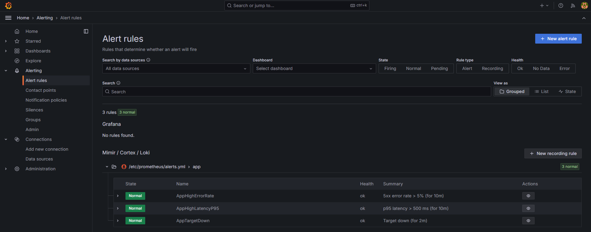

    - на дашборде Grafana "RED Demo App" видно 3 панели
      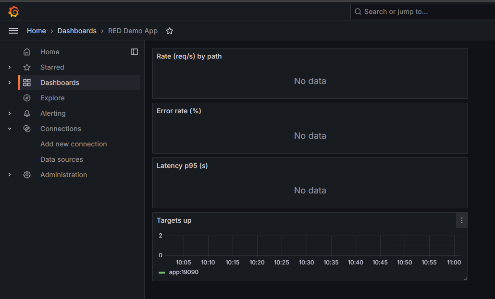

    - на дашборде Prometheus видно настроенную цель для снятия метрик
      

        и 3 настроенных алерта, которые ранее мы видели в Grafana
        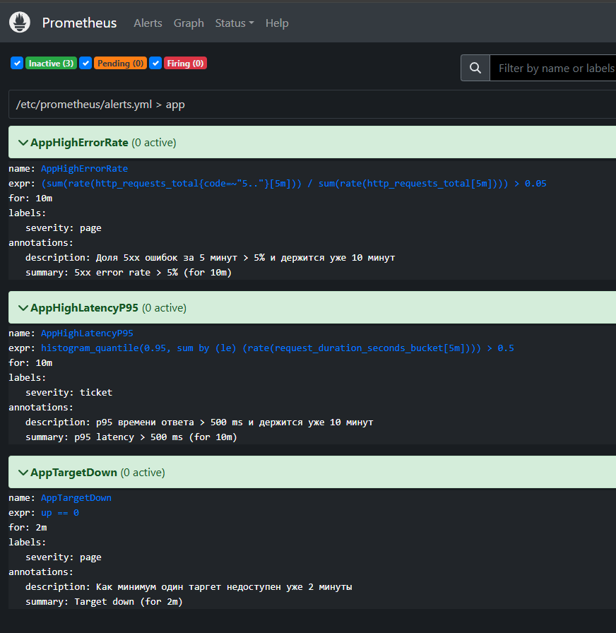

3. Нагрузочное тестирования

    - был запущен скрипт нагрузочного тестирования `dz-3/partA/load-test/run.sh` несколько раз в течение 10 минут
    - после начала запусков скрипта нагрузочного тестирования

    - в Grafana на дашборде отобразились графики по метрикам, на которые настроены алерты
      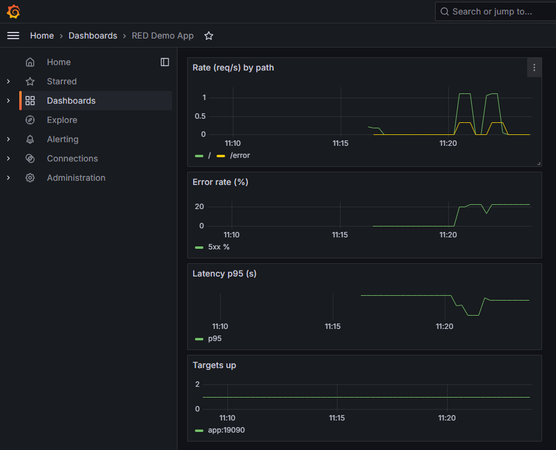

    - в Prometheus 2 алерта перешло в статус Pending, означающих, что была замечена аномалия, но указанный промежуток времени для зажигания алерта еще не прошел
      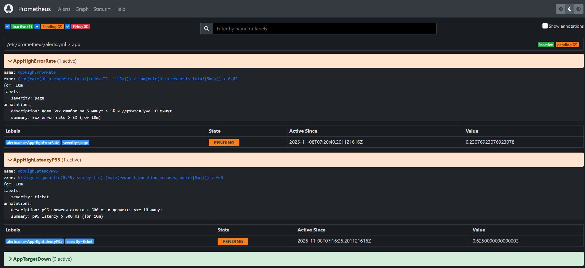

        в Grafana так же алерты перешли в состояние pending
        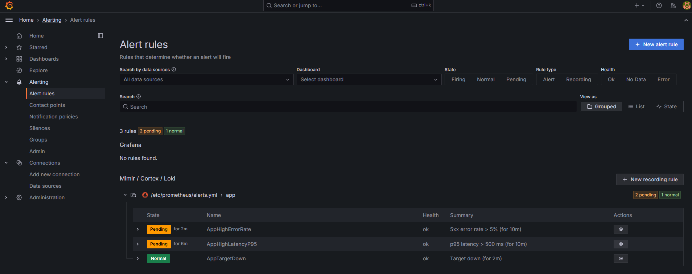

    - через некоторое время алерт, настроенный на метрику 95-перцентиля времени ответа от сервиса перешел в состояния Firing, что стало видно в Prometheus
      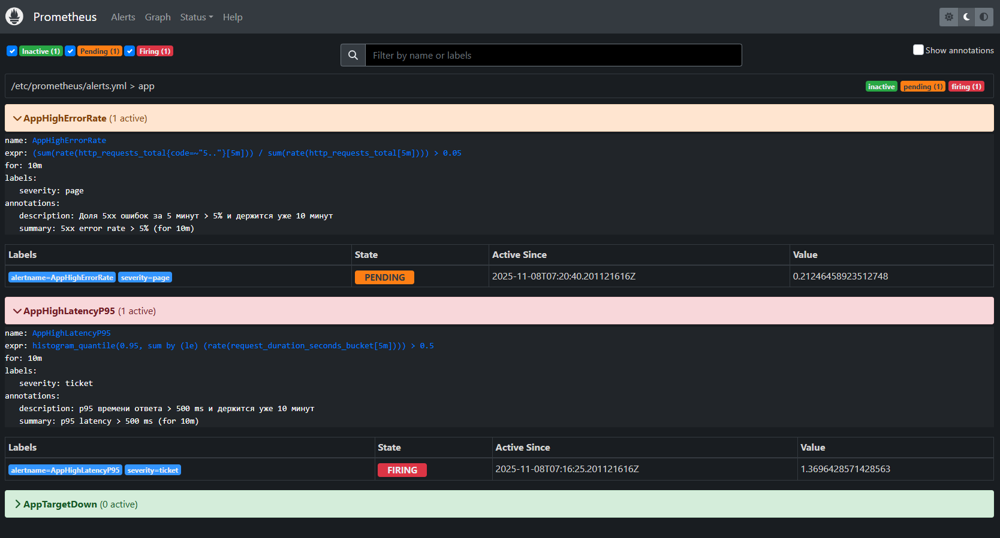

        а так же в Grafana
        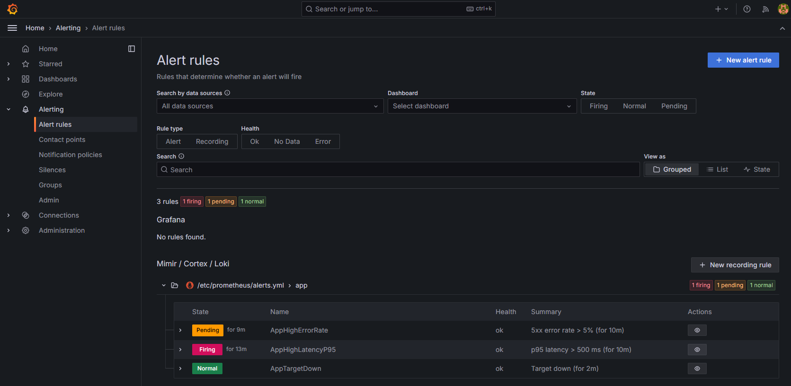

        также в Alertmanager появилось уведомление о зажженном алерте
        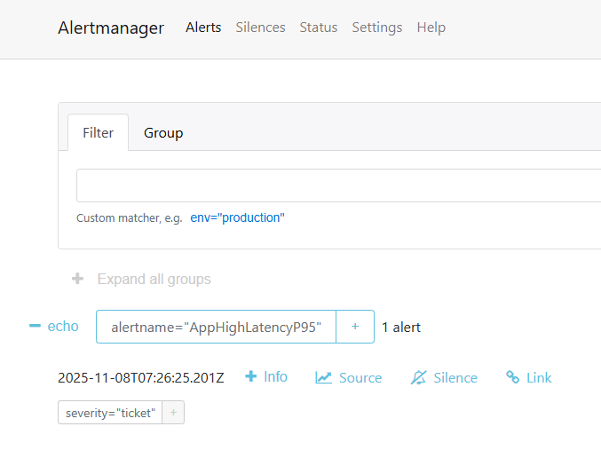

    - через еще небольшой промежуток времени сработал алерт настроенный на метрику кол-ва 500х ошибок ответа от сервиса, что стало видно в Prometheus
      

        а так же в Grafana
        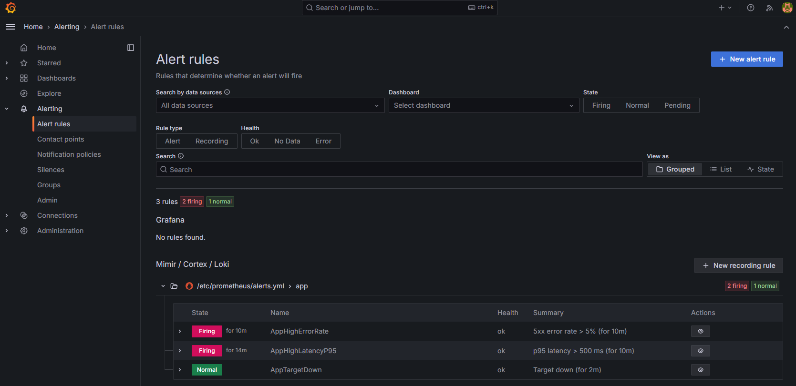

        также в Alertmanager появилось второе уведомление о зажженном алерте
        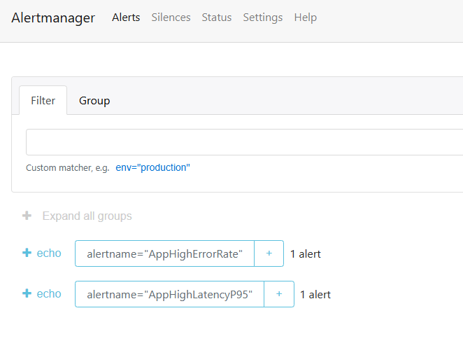

    - от Alertmanager также пришло 2 POST-запроса на echo-сервер о зажженных алертах

    ```sh
    Echo server listening on port 8080.
    --------  172.18.0.3:55634 | POST /
    00000000  7b 22 72 65 63 65 69 76  65 72 22 3a 22 65 63 68  |{"receiver":"ech|
    00000010  6f 22 2c 22 73 74 61 74  75 73 22 3a 22 66 69 72  |o","status":"fir|
    00000020  69 6e 67 22 2c 22 61 6c  65 72 74 73 22 3a 5b 7b  |ing","alerts":[{|
    00000030  22 73 74 61 74 75 73 22  3a 22 66 69 72 69 6e 67  |"status":"firing|
    00000040  22 2c 22 6c 61 62 65 6c  73 22 3a 7b 22 61 6c 65  |","labels":{"ale|
    00000050  72 74 6e 61 6d 65 22 3a  22 41 70 70 48 69 67 68  |rtname":"AppHigh|
    00000060  4c 61 74 65 6e 63 79 50  39 35 22 2c 22 73 65 76  |LatencyP95","sev|
    00000070  65 72 69 74 79 22 3a 22  74 69 63 6b 65 74 22 7d  |erity":"ticket"}|
    00000080  2c 22 61 6e 6e 6f 74 61  74 69 6f 6e 73 22 3a 7b  |,"annotations":{|
    00000090  22 64 65 73 63 72 69 70  74 69 6f 6e 22 3a 22 70  |"description":"p|
    000000a0  39 35 20 d0 b2 d1 80 d0  b5 d0 bc d0 b5 d0 bd d0  |95 .............|
    000000b0  b8 20 d0 be d1 82 d0 b2  d0 b5 d1 82 d0 b0 20 5c  |. ............ \|
    000000c0  75 30 30 33 65 20 35 30  30 20 6d 73 20 d0 b8 20  |u003e 500 ms .. |
    000000d0  d0 b4 d0 b5 d1 80 d0 b6  d0 b8 d1 82 d1 81 d1 8f  |................|
    000000e0  20 d1 83 d0 b6 d0 b5 20  31 30 20 d0 bc d0 b8 d0  | ...... 10 .....|
    000000f0  bd d1 83 d1 82 22 2c 22  73 75 6d 6d 61 72 79 22  |.....","summary"|
    00000100  3a 22 70 39 35 20 6c 61  74 65 6e 63 79 20 5c 75  |:"p95 latency \u|
    00000110  30 30 33 65 20 35 30 30  20 6d 73 20 28 66 6f 72  |003e 500 ms (for|
    00000120  20 31 30 6d 29 22 7d 2c  22 73 74 61 72 74 73 41  | 10m)"},"startsA|
    00000130  74 22 3a 22 32 30 32 35  2d 31 31 2d 30 38 54 30  |t":"2025-11-08T0|
    00000140  37 3a 35 33 3a 35 35 2e  32 30 31 5a 22 2c 22 65  |7:53:55.201Z","e|
    00000150  6e 64 73 41 74 22 3a 22  30 30 30 31 2d 30 31 2d  |ndsAt":"0001-01-|
    00000160  30 31 54 30 30 3a 30 30  3a 30 30 5a 22 2c 22 67  |01T00:00:00Z","g|
    00000170  65 6e 65 72 61 74 6f 72  55 52 4c 22 3a 22 68 74  |eneratorURL":"ht|
    00000180  74 70 3a 2f 2f 36 30 34  65 64 37 32 30 62 63 61  |tp://604ed720bca|
    00000190  61 3a 39 30 39 30 2f 67  72 61 70 68 3f 67 30 2e  |a:9090/graph?g0.|
    000001a0  65 78 70 72 3d 68 69 73  74 6f 67 72 61 6d 5f 71  |expr=histogram_q|
    000001b0  75 61 6e 74 69 6c 65 25  32 38 30 2e 39 35 25 32  |uantile%280.95%2|
    000001c0  43 2b 73 75 6d 2b 62 79  2b 25 32 38 6c 65 25 32  |C+sum+by+%28le%2|
    000001d0  39 2b 25 32 38 72 61 74  65 25 32 38 72 65 71 75  |9+%28rate%28requ|
    000001e0  65 73 74 5f 64 75 72 61  74 69 6f 6e 5f 73 65 63  |est_duration_sec|
    000001f0  6f 6e 64 73 5f 62 75 63  6b 65 74 25 35 42 35 6d  |onds_bucket%5B5m|
    00000200  25 35 44 25 32 39 25 32  39 25 32 39 2b 25 33 45  |%5D%29%29%29+%3E|
    00000210  2b 30 2e 35 5c 75 30 30  32 36 67 30 2e 74 61 62  |+0.5\u0026g0.tab|
    00000220  3d 31 22 2c 22 66 69 6e  67 65 72 70 72 69 6e 74  |=1","fingerprint|
    00000230  22 3a 22 34 34 61 35 34  36 65 31 39 32 33 66 64  |":"44a546e1923fd|
    00000240  36 34 65 22 7d 5d 2c 22  67 72 6f 75 70 4c 61 62  |64e"}],"groupLab|
    00000250  65 6c 73 22 3a 7b 22 61  6c 65 72 74 6e 61 6d 65  |els":{"alertname|
    00000260  22 3a 22 41 70 70 48 69  67 68 4c 61 74 65 6e 63  |":"AppHighLatenc|
    00000270  79 50 39 35 22 7d 2c 22  63 6f 6d 6d 6f 6e 4c 61  |yP95"},"commonLa|
    00000280  62 65 6c 73 22 3a 7b 22  61 6c 65 72 74 6e 61 6d  |bels":{"alertnam|
    00000290  65 22 3a 22 41 70 70 48  69 67 68 4c 61 74 65 6e  |e":"AppHighLaten|
    000002a0  63 79 50 39 35 22 2c 22  73 65 76 65 72 69 74 79  |cyP95","severity|
    000002b0  22 3a 22 74 69 63 6b 65  74 22 7d 2c 22 63 6f 6d  |":"ticket"},"com|
    000002c0  6d 6f 6e 41 6e 6e 6f 74  61 74 69 6f 6e 73 22 3a  |monAnnotations":|
    000002d0  7b 22 64 65 73 63 72 69  70 74 69 6f 6e 22 3a 22  |{"description":"|
    000002e0  70 39 35 20 d0 b2 d1 80  d0 b5 d0 bc d0 b5 d0 bd  |p95 ............|
    000002f0  d0 b8 20 d0 be d1 82 d0  b2 d0 b5 d1 82 d0 b0 20  |.. ............ |
    00000300  5c 75 30 30 33 65 20 35  30 30 20 6d 73 20 d0 b8  |\u003e 500 ms ..|
    00000310  20 d0 b4 d0 b5 d1 80 d0  b6 d0 b8 d1 82 d1 81 d1  | ...............|
    00000320  8f 20 d1 83 d0 b6 d0 b5  20 31 30 20 d0 bc d0 b8  |. ...... 10 ....|
    00000330  d0 bd d1 83 d1 82 22 2c  22 73 75 6d 6d 61 72 79  |......","summary|
    00000340  22 3a 22 70 39 35 20 6c  61 74 65 6e 63 79 20 5c  |":"p95 latency \|
    00000350  75 30 30 33 65 20 35 30  30 20 6d 73 20 28 66 6f  |u003e 500 ms (fo|
    00000360  72 20 31 30 6d 29 22 7d  2c 22 65 78 74 65 72 6e  |r 10m)"},"extern|
    00000370  61 6c 55 52 4c 22 3a 22  68 74 74 70 3a 2f 2f 64  |alURL":"http://d|
    00000380  33 31 63 32 61 61 63 61  34 64 66 3a 39 30 39 33  |31c2aaca4df:9093|
    00000390  22 2c 22 76 65 72 73 69  6f 6e 22 3a 22 34 22 2c  |","version":"4",|
    000003a0  22 67 72 6f 75 70 4b 65  79 22 3a 22 7b 7d 3a 7b  |"groupKey":"{}:{|
    000003b0  61 6c 65 72 74 6e 61 6d  65 3d 5c 22 41 70 70 48  |alertname=\"AppH|
    000003c0  69 67 68 4c 61 74 65 6e  63 79 50 39 35 5c 22 7d  |ighLatencyP95\"}|
    000003d0  22 2c 22 74 72 75 6e 63  61 74 65 64 41 6c 65 72  |","truncatedAler|
    000003e0  74 73 22 3a 30 7d 0a                              |ts":0}.|
    --------  172.18.0.3:55634 | POST /
    00000000  7b 22 72 65 63 65 69 76  65 72 22 3a 22 65 63 68  |{"receiver":"ech|
    00000010  6f 22 2c 22 73 74 61 74  75 73 22 3a 22 66 69 72  |o","status":"fir|
    00000020  69 6e 67 22 2c 22 61 6c  65 72 74 73 22 3a 5b 7b  |ing","alerts":[{|
    00000030  22 73 74 61 74 75 73 22  3a 22 66 69 72 69 6e 67  |"status":"firing|
    00000040  22 2c 22 6c 61 62 65 6c  73 22 3a 7b 22 61 6c 65  |","labels":{"ale|
    00000050  72 74 6e 61 6d 65 22 3a  22 41 70 70 48 69 67 68  |rtname":"AppHigh|
    00000060  45 72 72 6f 72 52 61 74  65 22 2c 22 73 65 76 65  |ErrorRate","seve|
    00000070  72 69 74 79 22 3a 22 70  61 67 65 22 7d 2c 22 61  |rity":"page"},"a|
    00000080  6e 6e 6f 74 61 74 69 6f  6e 73 22 3a 7b 22 64 65  |nnotations":{"de|
    00000090  73 63 72 69 70 74 69 6f  6e 22 3a 22 d0 94 d0 be  |scription":"....|
    000000a0  d0 bb d1 8f 20 35 78 78  20 d0 be d1 88 d0 b8 d0  |.... 5xx .......|
    000000b0  b1 d0 be d0 ba 20 d0 b7  d0 b0 20 35 20 d0 bc d0  |..... .... 5 ...|
    000000c0  b8 d0 bd d1 83 d1 82 20  5c 75 30 30 33 65 20 35  |....... \u003e 5|
    000000d0  25 20 d0 b8 20 d0 b4 d0  b5 d1 80 d0 b6 d0 b8 d1  |% .. ...........|
    000000e0  82 d1 81 d1 8f 20 d1 83  d0 b6 d0 b5 20 31 30 20  |..... ...... 10 |
    000000f0  d0 bc d0 b8 d0 bd d1 83  d1 82 22 2c 22 73 75 6d  |..........","sum|
    00000100  6d 61 72 79 22 3a 22 35  78 78 20 65 72 72 6f 72  |mary":"5xx error|
    00000110  20 72 61 74 65 20 5c 75  30 30 33 65 20 35 25 20  | rate \u003e 5% |
    00000120  28 66 6f 72 20 31 30 6d  29 22 7d 2c 22 73 74 61  |(for 10m)"},"sta|
    00000130  72 74 73 41 74 22 3a 22  32 30 32 35 2d 31 31 2d  |rtsAt":"2025-11-|
    00000140  30 38 54 30 37 3a 35 34  3a 31 30 2e 32 30 31 5a  |08T07:54:10.201Z|
    00000150  22 2c 22 65 6e 64 73 41  74 22 3a 22 30 30 30 31  |","endsAt":"0001|
    00000160  2d 30 31 2d 30 31 54 30  30 3a 30 30 3a 30 30 5a  |-01-01T00:00:00Z|
    00000170  22 2c 22 67 65 6e 65 72  61 74 6f 72 55 52 4c 22  |","generatorURL"|
    00000180  3a 22 68 74 74 70 3a 2f  2f 36 30 34 65 64 37 32  |:"http://604ed72|
    00000190  30 62 63 61 61 3a 39 30  39 30 2f 67 72 61 70 68  |0bcaa:9090/graph|
    000001a0  3f 67 30 2e 65 78 70 72  3d 25 32 38 73 75 6d 25  |?g0.expr=%28sum%|
    000001b0  32 38 72 61 74 65 25 32  38 68 74 74 70 5f 72 65  |28rate%28http_re|
    000001c0  71 75 65 73 74 73 5f 74  6f 74 61 6c 25 37 42 63  |quests_total%7Bc|
    000001d0  6f 64 65 25 33 44 7e 25  32 32 35 2e 2e 25 32 32  |ode%3D~%225..%22|
    000001e0  25 37 44 25 35 42 35 6d  25 35 44 25 32 39 25 32  |%7D%5B5m%5D%29%2|
    000001f0  39 2b 25 32 46 2b 73 75  6d 25 32 38 72 61 74 65  |9+%2F+sum%28rate|
    00000200  25 32 38 68 74 74 70 5f  72 65 71 75 65 73 74 73  |%28http_requests|
    00000210  5f 74 6f 74 61 6c 25 35  42 35 6d 25 35 44 25 32  |_total%5B5m%5D%2|
    00000220  39 25 32 39 25 32 39 2b  25 33 45 2b 30 2e 30 35  |9%29%29+%3E+0.05|
    00000230  5c 75 30 30 32 36 67 30  2e 74 61 62 3d 31 22 2c  |\u0026g0.tab=1",|
    00000240  22 66 69 6e 67 65 72 70  72 69 6e 74 22 3a 22 36  |"fingerprint":"6|
    00000250  66 62 36 66 33 62 36 66  37 33 63 61 65 64 37 22  |fb6f3b6f73caed7"|
    00000260  7d 5d 2c 22 67 72 6f 75  70 4c 61 62 65 6c 73 22  |}],"groupLabels"|
    00000270  3a 7b 22 61 6c 65 72 74  6e 61 6d 65 22 3a 22 41  |:{"alertname":"A|
    00000280  70 70 48 69 67 68 45 72  72 6f 72 52 61 74 65 22  |ppHighErrorRate"|
    00000290  7d 2c 22 63 6f 6d 6d 6f  6e 4c 61 62 65 6c 73 22  |},"commonLabels"|
    000002a0  3a 7b 22 61 6c 65 72 74  6e 61 6d 65 22 3a 22 41  |:{"alertname":"A|
    000002b0  70 70 48 69 67 68 45 72  72 6f 72 52 61 74 65 22  |ppHighErrorRate"|
    000002c0  2c 22 73 65 76 65 72 69  74 79 22 3a 22 70 61 67  |,"severity":"pag|
    000002d0  65 22 7d 2c 22 63 6f 6d  6d 6f 6e 41 6e 6e 6f 74  |e"},"commonAnnot|
    000002e0  61 74 69 6f 6e 73 22 3a  7b 22 64 65 73 63 72 69  |ations":{"descri|
    000002f0  70 74 69 6f 6e 22 3a 22  d0 94 d0 be d0 bb d1 8f  |ption":"........|
    00000300  20 35 78 78 20 d0 be d1  88 d0 b8 d0 b1 d0 be d0  | 5xx ...........|
    00000310  ba 20 d0 b7 d0 b0 20 35  20 d0 bc d0 b8 d0 bd d1  |. .... 5 .......|
    00000320  83 d1 82 20 5c 75 30 30  33 65 20 35 25 20 d0 b8  |... \u003e 5% ..|
    00000330  20 d0 b4 d0 b5 d1 80 d0  b6 d0 b8 d1 82 d1 81 d1  | ...............|
    00000340  8f 20 d1 83 d0 b6 d0 b5  20 31 30 20 d0 bc d0 b8  |. ...... 10 ....|
    00000350  d0 bd d1 83 d1 82 22 2c  22 73 75 6d 6d 61 72 79  |......","summary|
    00000360  22 3a 22 35 78 78 20 65  72 72 6f 72 20 72 61 74  |":"5xx error rat|
    00000370  65 20 5c 75 30 30 33 65  20 35 25 20 28 66 6f 72  |e \u003e 5% (for|
    00000380  20 31 30 6d 29 22 7d 2c  22 65 78 74 65 72 6e 61  | 10m)"},"externa|
    00000390  6c 55 52 4c 22 3a 22 68  74 74 70 3a 2f 2f 64 33  |lURL":"http://d3|
    000003a0  31 63 32 61 61 63 61 34  64 66 3a 39 30 39 33 22  |1c2aaca4df:9093"|
    000003b0  2c 22 76 65 72 73 69 6f  6e 22 3a 22 34 22 2c 22  |,"version":"4","|
    000003c0  67 72 6f 75 70 4b 65 79  22 3a 22 7b 7d 3a 7b 61  |groupKey":"{}:{a|
    000003d0  6c 65 72 74 6e 61 6d 65  3d 5c 22 41 70 70 48 69  |lertname=\"AppHi|
    000003e0  67 68 45 72 72 6f 72 52  61 74 65 5c 22 7d 22 2c  |ghErrorRate\"}",|
    000003f0  22 74 72 75 6e 63 61 74  65 64 41 6c 65 72 74 73  |"truncatedAlerts|
    00000400  22 3a 30 7d 0a                                    |":0}.|
    ```

    - после этого отправка нагрузки через скрипт была остановлена
      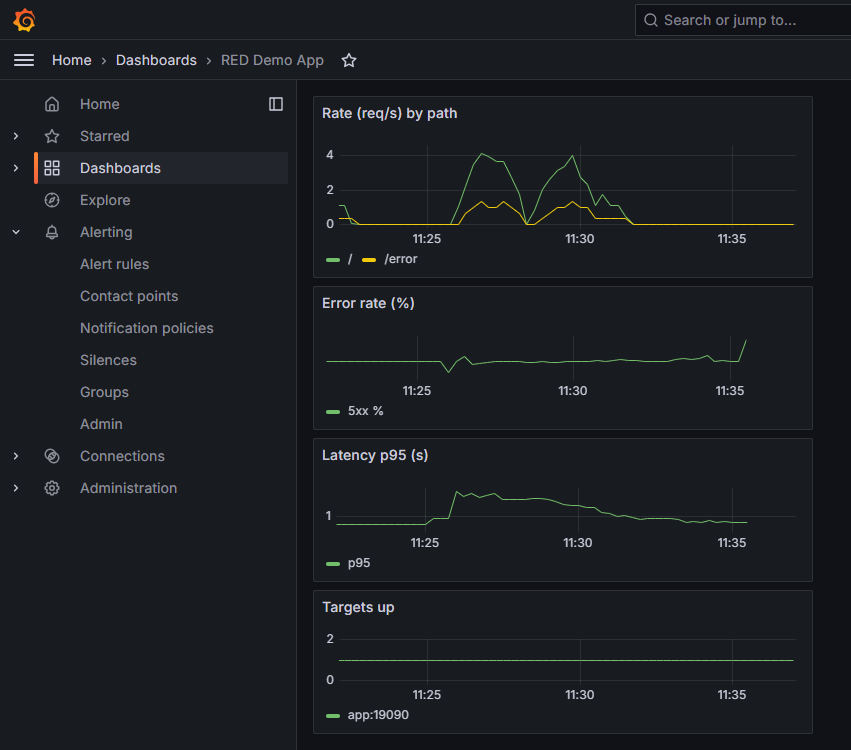

    - спустя время оба зажженных алерта перешли в нормальное состояние, что можно видеть в Prometheus
      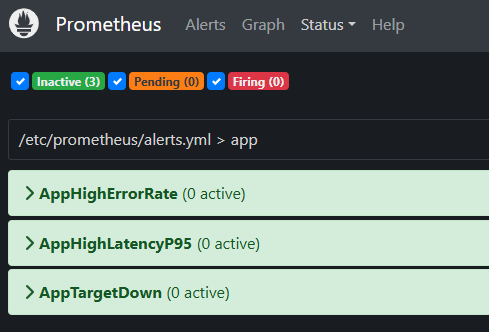

        а так же в Grafana
        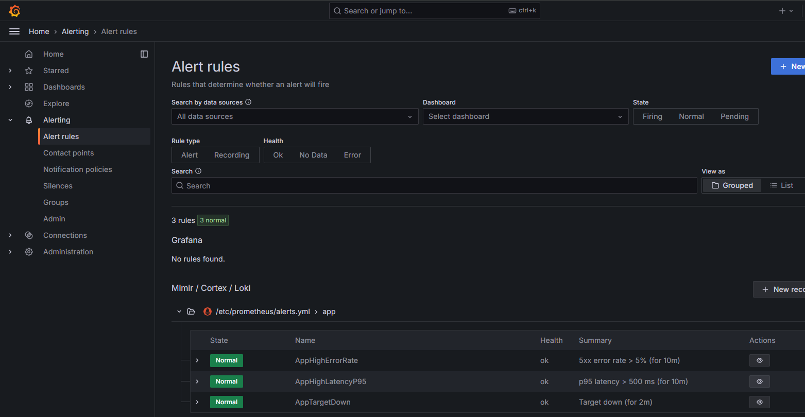

        также в Alertmanager исчезли оба уведомления о зажженных алертах
        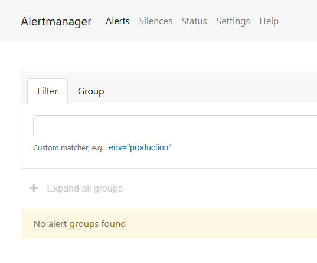

    - от Alertmanager пришло 2 POST-запроса на echo-сервер о переходе алертов в нормальное состояние

    ```sh
    --------  172.18.0.3:53172 | POST /
    00000000  7b 22 72 65 63 65 69 76  65 72 22 3a 22 65 63 68  |{"receiver":"ech|
    00000010  6f 22 2c 22 73 74 61 74  75 73 22 3a 22 72 65 73  |o","status":"res|
    00000020  6f 6c 76 65 64 22 2c 22  61 6c 65 72 74 73 22 3a  |olved","alerts":|
    00000030  5b 7b 22 73 74 61 74 75  73 22 3a 22 72 65 73 6f  |[{"status":"reso|
    00000040  6c 76 65 64 22 2c 22 6c  61 62 65 6c 73 22 3a 7b  |lved","labels":{|
    00000050  22 61 6c 65 72 74 6e 61  6d 65 22 3a 22 41 70 70  |"alertname":"App|
    00000060  48 69 67 68 4c 61 74 65  6e 63 79 50 39 35 22 2c  |HighLatencyP95",|
    00000070  22 73 65 76 65 72 69 74  79 22 3a 22 74 69 63 6b  |"severity":"tick|
    00000080  65 74 22 7d 2c 22 61 6e  6e 6f 74 61 74 69 6f 6e  |et"},"annotation|
    00000090  73 22 3a 7b 22 64 65 73  63 72 69 70 74 69 6f 6e  |s":{"description|
    000000a0  22 3a 22 70 39 35 20 d0  b2 d1 80 d0 b5 d0 bc d0  |":"p95 .........|
    000000b0  b5 d0 bd d0 b8 20 d0 be  d1 82 d0 b2 d0 b5 d1 82  |..... ..........|
    000000c0  d0 b0 20 5c 75 30 30 33  65 20 35 30 30 20 6d 73  |.. \u003e 500 ms|
    000000d0  20 d0 b8 20 d0 b4 d0 b5  d1 80 d0 b6 d0 b8 d1 82  | .. ............|
    000000e0  d1 81 d1 8f 20 d1 83 d0  b6 d0 b5 20 31 30 20 d0  |.... ...... 10 .|
    000000f0  bc d0 b8 d0 bd d1 83 d1  82 22 2c 22 73 75 6d 6d  |.........","summ|
    00000100  61 72 79 22 3a 22 70 39  35 20 6c 61 74 65 6e 63  |ary":"p95 latenc|
    00000110  79 20 5c 75 30 30 33 65  20 35 30 30 20 6d 73 20  |y \u003e 500 ms |
    00000120  28 66 6f 72 20 31 30 6d  29 22 7d 2c 22 73 74 61  |(for 10m)"},"sta|
    00000130  72 74 73 41 74 22 3a 22  32 30 32 35 2d 31 31 2d  |rtsAt":"2025-11-|
    00000140  30 38 54 30 37 3a 35 33  3a 35 35 2e 32 30 31 5a  |08T07:53:55.201Z|
    00000150  22 2c 22 65 6e 64 73 41  74 22 3a 22 32 30 32 35  |","endsAt":"2025|
    00000160  2d 31 31 2d 30 38 54 30  37 3a 35 39 3a 32 35 2e  |-11-08T07:59:25.|
    00000170  32 30 31 5a 22 2c 22 67  65 6e 65 72 61 74 6f 72  |201Z","generator|
    00000180  55 52 4c 22 3a 22 68 74  74 70 3a 2f 2f 36 30 34  |URL":"http://604|
    00000190  65 64 37 32 30 62 63 61  61 3a 39 30 39 30 2f 67  |ed720bcaa:9090/g|
    000001a0  72 61 70 68 3f 67 30 2e  65 78 70 72 3d 68 69 73  |raph?g0.expr=his|
    000001b0  74 6f 67 72 61 6d 5f 71  75 61 6e 74 69 6c 65 25  |togram_quantile%|
    000001c0  32 38 30 2e 39 35 25 32  43 2b 73 75 6d 2b 62 79  |280.95%2C+sum+by|
    000001d0  2b 25 32 38 6c 65 25 32  39 2b 25 32 38 72 61 74  |+%28le%29+%28rat|
    000001e0  65 25 32 38 72 65 71 75  65 73 74 5f 64 75 72 61  |e%28request_dura|
    000001f0  74 69 6f 6e 5f 73 65 63  6f 6e 64 73 5f 62 75 63  |tion_seconds_buc|
    00000200  6b 65 74 25 35 42 35 6d  25 35 44 25 32 39 25 32  |ket%5B5m%5D%29%2|
    00000210  39 25 32 39 2b 25 33 45  2b 30 2e 35 5c 75 30 30  |9%29+%3E+0.5\u00|
    00000220  32 36 67 30 2e 74 61 62  3d 31 22 2c 22 66 69 6e  |26g0.tab=1","fin|
    00000230  67 65 72 70 72 69 6e 74  22 3a 22 34 34 61 35 34  |gerprint":"44a54|
    00000240  36 65 31 39 32 33 66 64  36 34 65 22 7d 5d 2c 22  |6e1923fd64e"}],"|
    00000250  67 72 6f 75 70 4c 61 62  65 6c 73 22 3a 7b 22 61  |groupLabels":{"a|
    00000260  6c 65 72 74 6e 61 6d 65  22 3a 22 41 70 70 48 69  |lertname":"AppHi|
    00000270  67 68 4c 61 74 65 6e 63  79 50 39 35 22 7d 2c 22  |ghLatencyP95"},"|
    00000280  63 6f 6d 6d 6f 6e 4c 61  62 65 6c 73 22 3a 7b 22  |commonLabels":{"|
    00000290  61 6c 65 72 74 6e 61 6d  65 22 3a 22 41 70 70 48  |alertname":"AppH|
    000002a0  69 67 68 4c 61 74 65 6e  63 79 50 39 35 22 2c 22  |ighLatencyP95","|
    000002b0  73 65 76 65 72 69 74 79  22 3a 22 74 69 63 6b 65  |severity":"ticke|
    000002c0  74 22 7d 2c 22 63 6f 6d  6d 6f 6e 41 6e 6e 6f 74  |t"},"commonAnnot|
    000002d0  61 74 69 6f 6e 73 22 3a  7b 22 64 65 73 63 72 69  |ations":{"descri|
    000002e0  70 74 69 6f 6e 22 3a 22  70 39 35 20 d0 b2 d1 80  |ption":"p95 ....|
    000002f0  d0 b5 d0 bc d0 b5 d0 bd  d0 b8 20 d0 be d1 82 d0  |.......... .....|
    00000300  b2 d0 b5 d1 82 d0 b0 20  5c 75 30 30 33 65 20 35  |....... \u003e 5|
    00000310  30 30 20 6d 73 20 d0 b8  20 d0 b4 d0 b5 d1 80 d0  |00 ms .. .......|
    00000320  b6 d0 b8 d1 82 d1 81 d1  8f 20 d1 83 d0 b6 d0 b5  |......... ......|
    00000330  20 31 30 20 d0 bc d0 b8  d0 bd d1 83 d1 82 22 2c  | 10 ..........",|
    00000340  22 73 75 6d 6d 61 72 79  22 3a 22 70 39 35 20 6c  |"summary":"p95 l|
    00000350  61 74 65 6e 63 79 20 5c  75 30 30 33 65 20 35 30  |atency \u003e 50|
    00000360  30 20 6d 73 20 28 66 6f  72 20 31 30 6d 29 22 7d  |0 ms (for 10m)"}|
    00000370  2c 22 65 78 74 65 72 6e  61 6c 55 52 4c 22 3a 22  |,"externalURL":"|
    00000380  68 74 74 70 3a 2f 2f 64  33 31 63 32 61 61 63 61  |http://d31c2aaca|
    00000390  34 64 66 3a 39 30 39 33  22 2c 22 76 65 72 73 69  |4df:9093","versi|
    000003a0  6f 6e 22 3a 22 34 22 2c  22 67 72 6f 75 70 4b 65  |on":"4","groupKe|
    000003b0  79 22 3a 22 7b 7d 3a 7b  61 6c 65 72 74 6e 61 6d  |y":"{}:{alertnam|
    000003c0  65 3d 5c 22 41 70 70 48  69 67 68 4c 61 74 65 6e  |e=\"AppHighLaten|
    000003d0  63 79 50 39 35 5c 22 7d  22 2c 22 74 72 75 6e 63  |cyP95\"}","trunc|
    000003e0  61 74 65 64 41 6c 65 72  74 73 22 3a 30 7d 0a     |atedAlerts":0}.|
    --------  172.18.0.3:53172 | POST /
    00000000  7b 22 72 65 63 65 69 76  65 72 22 3a 22 65 63 68  |{"receiver":"ech|
    00000010  6f 22 2c 22 73 74 61 74  75 73 22 3a 22 72 65 73  |o","status":"res|
    00000020  6f 6c 76 65 64 22 2c 22  61 6c 65 72 74 73 22 3a  |olved","alerts":|
    00000030  5b 7b 22 73 74 61 74 75  73 22 3a 22 72 65 73 6f  |[{"status":"reso|
    00000040  6c 76 65 64 22 2c 22 6c  61 62 65 6c 73 22 3a 7b  |lved","labels":{|
    00000050  22 61 6c 65 72 74 6e 61  6d 65 22 3a 22 41 70 70  |"alertname":"App|
    00000060  48 69 67 68 45 72 72 6f  72 52 61 74 65 22 2c 22  |HighErrorRate","|
    00000070  73 65 76 65 72 69 74 79  22 3a 22 70 61 67 65 22  |severity":"page"|
    00000080  7d 2c 22 61 6e 6e 6f 74  61 74 69 6f 6e 73 22 3a  |},"annotations":|
    00000090  7b 22 64 65 73 63 72 69  70 74 69 6f 6e 22 3a 22  |{"description":"|
    000000a0  d0 94 d0 be d0 bb d1 8f  20 35 78 78 20 d0 be d1  |........ 5xx ...|
    000000b0  88 d0 b8 d0 b1 d0 be d0  ba 20 d0 b7 d0 b0 20 35  |......... .... 5|
    000000c0  20 d0 bc d0 b8 d0 bd d1  83 d1 82 20 5c 75 30 30  | .......... \u00|
    000000d0  33 65 20 35 25 20 d0 b8  20 d0 b4 d0 b5 d1 80 d0  |3e 5% .. .......|
    000000e0  b6 d0 b8 d1 82 d1 81 d1  8f 20 d1 83 d0 b6 d0 b5  |......... ......|
    000000f0  20 31 30 20 d0 bc d0 b8  d0 bd d1 83 d1 82 22 2c  | 10 ..........",|
    00000100  22 73 75 6d 6d 61 72 79  22 3a 22 35 78 78 20 65  |"summary":"5xx e|
    00000110  72 72 6f 72 20 72 61 74  65 20 5c 75 30 30 33 65  |rror rate \u003e|
    00000120  20 35 25 20 28 66 6f 72  20 31 30 6d 29 22 7d 2c  | 5% (for 10m)"},|
    00000130  22 73 74 61 72 74 73 41  74 22 3a 22 32 30 32 35  |"startsAt":"2025|
    00000140  2d 31 31 2d 30 38 54 30  37 3a 35 34 3a 31 30 2e  |-11-08T07:54:10.|
    00000150  32 30 31 5a 22 2c 22 65  6e 64 73 41 74 22 3a 22  |201Z","endsAt":"|
    00000160  32 30 32 35 2d 31 31 2d  30 38 54 30 37 3a 35 39  |2025-11-08T07:59|
    00000170  3a 32 35 2e 32 30 31 5a  22 2c 22 67 65 6e 65 72  |:25.201Z","gener|
    00000180  61 74 6f 72 55 52 4c 22  3a 22 68 74 74 70 3a 2f  |atorURL":"http:/|
    00000190  2f 36 30 34 65 64 37 32  30 62 63 61 61 3a 39 30  |/604ed720bcaa:90|
    000001a0  39 30 2f 67 72 61 70 68  3f 67 30 2e 65 78 70 72  |90/graph?g0.expr|
    000001b0  3d 25 32 38 73 75 6d 25  32 38 72 61 74 65 25 32  |=%28sum%28rate%2|
    000001c0  38 68 74 74 70 5f 72 65  71 75 65 73 74 73 5f 74  |8http_requests_t|
    000001d0  6f 74 61 6c 25 37 42 63  6f 64 65 25 33 44 7e 25  |otal%7Bcode%3D~%|
    000001e0  32 32 35 2e 2e 25 32 32  25 37 44 25 35 42 35 6d  |225..%22%7D%5B5m|
    000001f0  25 35 44 25 32 39 25 32  39 2b 25 32 46 2b 73 75  |%5D%29%29+%2F+su|
    00000200  6d 25 32 38 72 61 74 65  25 32 38 68 74 74 70 5f  |m%28rate%28http_|
    00000210  72 65 71 75 65 73 74 73  5f 74 6f 74 61 6c 25 35  |requests_total%5|
    00000220  42 35 6d 25 35 44 25 32  39 25 32 39 25 32 39 2b  |B5m%5D%29%29%29+|
    00000230  25 33 45 2b 30 2e 30 35  5c 75 30 30 32 36 67 30  |%3E+0.05\u0026g0|
    00000240  2e 74 61 62 3d 31 22 2c  22 66 69 6e 67 65 72 70  |.tab=1","fingerp|
    00000250  72 69 6e 74 22 3a 22 36  66 62 36 66 33 62 36 66  |rint":"6fb6f3b6f|
    00000260  37 33 63 61 65 64 37 22  7d 5d 2c 22 67 72 6f 75  |73caed7"}],"grou|
    00000270  70 4c 61 62 65 6c 73 22  3a 7b 22 61 6c 65 72 74  |pLabels":{"alert|
    00000280  6e 61 6d 65 22 3a 22 41  70 70 48 69 67 68 45 72  |name":"AppHighEr|
    00000290  72 6f 72 52 61 74 65 22  7d 2c 22 63 6f 6d 6d 6f  |rorRate"},"commo|
    000002a0  6e 4c 61 62 65 6c 73 22  3a 7b 22 61 6c 65 72 74  |nLabels":{"alert|
    000002b0  6e 61 6d 65 22 3a 22 41  70 70 48 69 67 68 45 72  |name":"AppHighEr|
    000002c0  72 6f 72 52 61 74 65 22  2c 22 73 65 76 65 72 69  |rorRate","severi|
    000002d0  74 79 22 3a 22 70 61 67  65 22 7d 2c 22 63 6f 6d  |ty":"page"},"com|
    000002e0  6d 6f 6e 41 6e 6e 6f 74  61 74 69 6f 6e 73 22 3a  |monAnnotations":|
    000002f0  7b 22 64 65 73 63 72 69  70 74 69 6f 6e 22 3a 22  |{"description":"|
    00000300  d0 94 d0 be d0 bb d1 8f  20 35 78 78 20 d0 be d1  |........ 5xx ...|
    00000310  88 d0 b8 d0 b1 d0 be d0  ba 20 d0 b7 d0 b0 20 35  |......... .... 5|
    00000320  20 d0 bc d0 b8 d0 bd d1  83 d1 82 20 5c 75 30 30  | .......... \u00|
    00000330  33 65 20 35 25 20 d0 b8  20 d0 b4 d0 b5 d1 80 d0  |3e 5% .. .......|
    00000340  b6 d0 b8 d1 82 d1 81 d1  8f 20 d1 83 d0 b6 d0 b5  |......... ......|
    00000350  20 31 30 20 d0 bc d0 b8  d0 bd d1 83 d1 82 22 2c  | 10 ..........",|
    00000360  22 73 75 6d 6d 61 72 79  22 3a 22 35 78 78 20 65  |"summary":"5xx e|
    00000370  72 72 6f 72 20 72 61 74  65 20 5c 75 30 30 33 65  |rror rate \u003e|
    00000380  20 35 25 20 28 66 6f 72  20 31 30 6d 29 22 7d 2c  | 5% (for 10m)"},|
    00000390  22 65 78 74 65 72 6e 61  6c 55 52 4c 22 3a 22 68  |"externalURL":"h|
    000003a0  74 74 70 3a 2f 2f 64 33  31 63 32 61 61 63 61 34  |ttp://d31c2aaca4|
    000003b0  64 66 3a 39 30 39 33 22  2c 22 76 65 72 73 69 6f  |df:9093","versio|
    000003c0  6e 22 3a 22 34 22 2c 22  67 72 6f 75 70 4b 65 79  |n":"4","groupKey|
    000003d0  22 3a 22 7b 7d 3a 7b 61  6c 65 72 74 6e 61 6d 65  |":"{}:{alertname|
    000003e0  3d 5c 22 41 70 70 48 69  67 68 45 72 72 6f 72 52  |=\"AppHighErrorR|
    000003f0  61 74 65 5c 22 7d 22 2c  22 74 72 75 6e 63 61 74  |ate\"}","truncat|
    00000400  65 64 41 6c 65 72 74 73  22 3a 30 7d 0a           |edAlerts":0}.|
    ```
