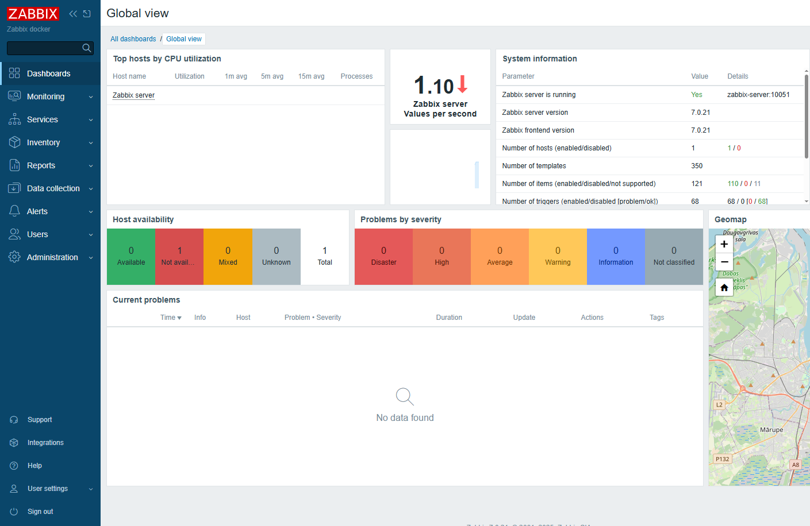
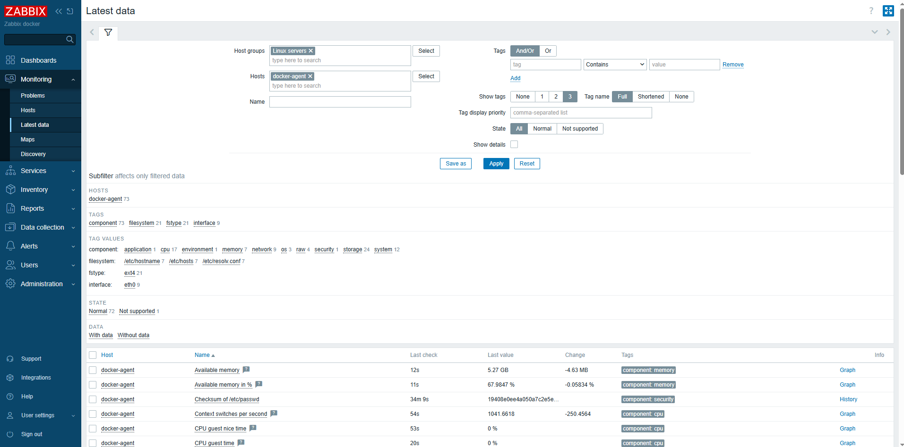
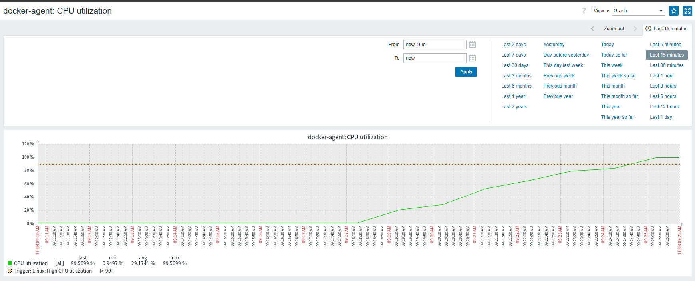
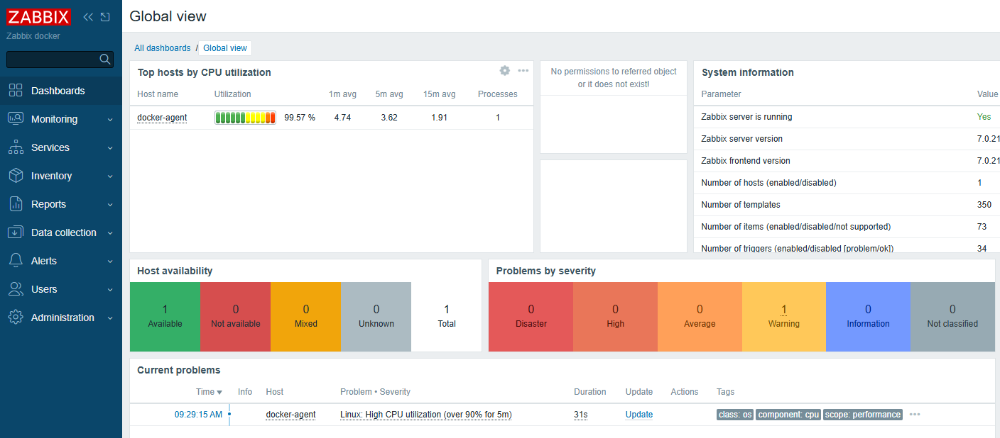
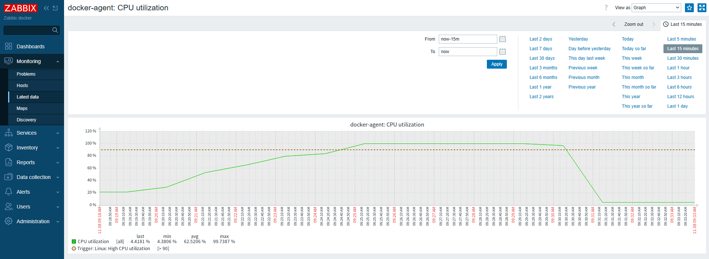
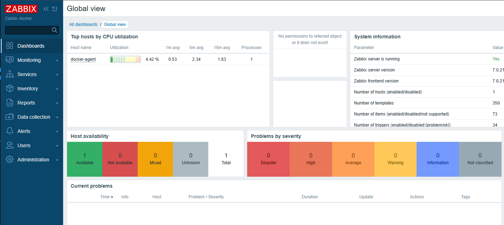

# Часть B

Шаги выполнения:

1. Запуск окружения

    - выполнен переход в директорию `dz-3/partB`
    - выполнена команда `docker compose -f docker-compose.zabbix.yml up -d`
    - в результате подняты контейнеры с нужным окружением

    ```sh
    developer@ubuntu-dev:~$ docker ps -a
    CONTAINER ID   IMAGE                                             COMMAND                  CREATED          STATUS                    PORTS                                                   NAMES
    e32f81ff8d38   zabbix/zabbix-web-nginx-pgsql:alpine-7.0-latest   "docker-entrypoint.sh"   6 seconds ago   Up 5 seconds (healthy)   8443/tcp, 0.0.0.0:8085->8080/tcp, [::]:8085->8080/tcp   zabbix-web
    95cb54ede6f1   zabbix/zabbix-server-pgsql:alpine-7.0-latest      "/usr/bin/docker-ent…"   6 seconds ago   Up 5 seconds             0.0.0.0:10051->10051/tcp, [::]:10051->10051/tcp         zabbix-server
    50e9e472c2dd   zabbix/zabbix-agent2:alpine-7.0-latest            "/usr/bin/docker-ent…"   6 seconds ago   Up 5 seconds             10050/tcp, 31999/tcp                                    zabbix-agent2
    56d3db305bdd   postgres:16-alpine                                "docker-entrypoint.s…"   6 seconds ago   Up 5 seconds             5432/tcp                                                zbx-postgres
    ```

2. Состояние после инициализации

    - web-клиент Zabbix успешно поднялся и удалось в него зайти
      

    - был настроен хост для наблюдения
      

    - в Latest data начала собираться и отображаться актуальная информация по параметрам наблюдаемого хоста
      

3. Нагрузочное тестирования

    - для эмуляции нагрузки на хост была запущена команда `dd if=/dev/urandom | bzip2 -9 > /dev/null` в 4 сессиях (по количеству доступных системе ядер CPU)

    - на графике нагрузки утилизации CPU стала заметна проблема
      

    - через примерно 5 минут, после превышения установленного лимита (90% утилизации CPU), Zabbix зарегистрировал проблему, которая отобразилась в том числе на основном дашборде
      

    - нагрузка была остановлена, и после снижения метрики ниже уровня лимита проблема была устранена
      

        на дашборде также проблема пропала
        
