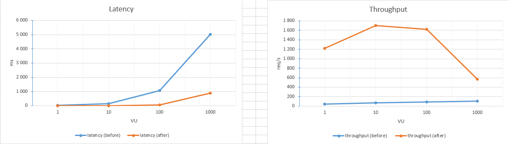

# Занятие 13 - Индексы

Шаги выполнения:

1. Запуск окружения

    - выполнена команда `docker compose up -d`
    - в результате подняты контейнеры с нужным окружением

    ```sh
    developer@ubuntu-dev:~$ docker ps
    CONTAINER ID   IMAGE                      COMMAND                  CREATED       STATUS       PORTS                                         NAMES
    242dce852ee2   homework-backend           "./backend"              2 hours ago   Up 2 hours   0.0.0.0:3000->3000/tcp, [::]:3000->3000/tcp   backend
    5d2d04e02552   postgres:18.0-alpine3.22   "docker-entrypoint.s…"   2 hours ago   Up 2 hours   5432/tcp                                      postgres
    ```

2. Нагрузочное тестирование до добавления индекса

    - для проведения нагрузочного тестирования был выбран инструмент `k6`
    - в файле `k6-load-test.js` был описан сценарий нагрузочного тестирования
    - была выполнена команда `k6 run k6-load-test.js --vus 1 --duration 10s`
    - после выполнения были выполнены аналогичные запуски, но с измененным количеством VUs - 10, 100, 1000
    - в результате были получены следующие результаты:

        | VUs  | Latency (ms) | Throughput (req/s) |
        | ---- | ------------ | ------------------ |
        | 1    | 22.84        | 43.74              |
        | 10   | 143.96       | 69.28              |
        | 100  | 1070         | 90.93              |
        | 1000 | 5010         | 101.99             |

3. Оптимизация запроса к таблицу в БД

    - в бекенде для получения данных используется следующий запрос к БД
        ```sql
        SELECT * FROM users WHERE first_name LIKE %{$1}% AND second_name LIKE %{$2}%;
        ```
    - в данном запросе требуется проводить поиск подстроки в любой части слова
    - для оптимизации такого запроса нам нужен составной индекс на поля `first_name`, `second_name`, который позволит искать по подстрокам с помощью оператора `LIKE`
    - хорошим выбором в текущем варианте будет создание индекса типа GIN (Generalized Inverted Index), т.к этот индекс разбивает входящие строки на три-граммы и позволяет эффективно производить поиск по входящим в слова подстрокам
    - был выполнен вход в клиент `psql` и создан индекс командой

        ```sql
        CREATE INDEX users_trgm_idx ON users USING gin (first_name gin_trgm_ops, second_name gin_trgm_ops);
        ```

    - перед созданием индекса был выполнен анализирующий запрос, для оценки эффективности индекса

        ```sql
        test=# EXPLAIN ANALYZE SELECT * FROM users WHERE first_name LIKE '%Але%' AND second_name LIKE '%Пет%';
                                                           QUERY PLAN
        ----------------------------------------------------------------------------------------------------------------------------
         Gather  (cost=1000.00..18318.06 rows=1005 width=55) (actual time=25.100..35.979 rows=816.00 loops=1)
           Workers Planned: 2
           Workers Launched: 2
           Buffers: shared hit=10968
           ->  Parallel Seq Scan on users  (cost=0.00..17217.56 rows=419 width=55) (actual time=21.209..29.565 rows=272.00 loops=3)
                 Filter: ((first_name ~~ '%Але%'::text) AND (second_name ~~ '%Пет%'::text))
                 Rows Removed by Filter: 333038
                 Buffers: shared hit=10968
         Planning:
           Buffers: shared hit=51
         Planning Time: 0.690 ms
         Execution Time: 36.026 ms
        (12 rows)
        ```

    - тот же запрос после добавления индекса

        ```sql
        test=# EXPLAIN ANALYZE SELECT * FROM users WHERE first_name LIKE '%Але%' AND second_name LIKE '%Пет%';
                                                                  QUERY PLAN
        -------------------------------------------------------------------------------------------------------------------------------
        Bitmap Heap Scan on users  (cost=37.24..2099.30 rows=643 width=55) (actual time=0.637..0.935 rows=816.00 loops=1)
          Recheck Cond: ((first_name ~~ '%Але%'::text) AND (second_name ~~ '%Пет%'::text))
          Rows Removed by Index Recheck: 170
          Heap Blocks: exact=152
          Buffers: shared hit=165
          ->  Bitmap Index Scan on users_trgm_idx  (cost=0.00..37.08 rows=643 width=0) (actual time=0.612..0.612 rows=986.00 loops=1)
                Index Cond: ((first_name ~~ '%Але%'::text) AND (second_name ~~ '%Пет%'::text))
                Index Searches: 1
                Buffers: shared hit=13
        Planning:
          Buffers: shared hit=1
        Planning Time: 0.365 ms
        Execution Time: 1.028 ms
        (13 rows)
        ```

4. Нагрузочное тестирование после добавления индекса

    - была выполнена команда `k6 run k6-load-test.js --vus 1 --duration 10s`
    - после выполнения были выполнены аналогичные запуски, но с измененным количеством VUs - 10, 100, 1000
    - в результате были получены следующие результаты:

        | VUs  | Latency (ms) | Throughput (req/s) |
        | ---- | ------------ | ------------------ |
        | 1    | 0.811        | 1224.34            |
        | 10   | 5.84         | 1705.91            |
        | 100  | 61.15        | 1624.48            |
        | 1000 | 887.88       | 567.77             |

5. Результаты

    - графики сравнения задержки и доступности сервиса до и после оптимизации запроса к БД:

        

    - по результатам видно, что задержка на выполнение запроса уменьшилась в среднем в 20 раз после оптимизации запроса

    - кол-во успешно обработанных запросов бекендом за единицу времени увеличилось в среднем так же в 20-25 раз

    - при большом количестве клиентов количество успешно обработанных запросов упало из-за общей перегрузки системы, т.к. и бекенд с БД и инструмент генерации запросов находились на одной машине
